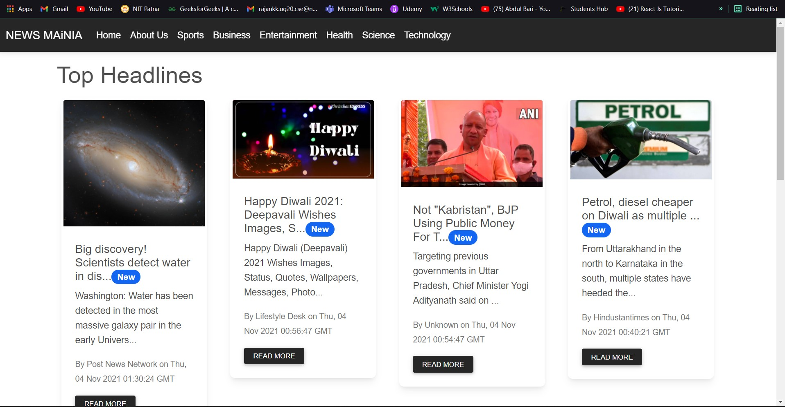

# Getting Started with NEWS MAiNIA 
Clone the repository using git bash 
```
git clone https://github.com/krcpr007/NEWSMAiNIA.git
cd NEWSMAiNIA 

npm install

In the project directory, you can run:

npm start
```
## This is how its look 


Runs the app in the development mode.\
Open [http://localhost:3000](http://localhost:3000) to view it in the browser.

### Contact me here 
[LinkedIn](https://www.linkedin.com/in/krcpr007)

[Instagram](https://www.instagram.com/cr7.rajan)

### Happy Coding <3